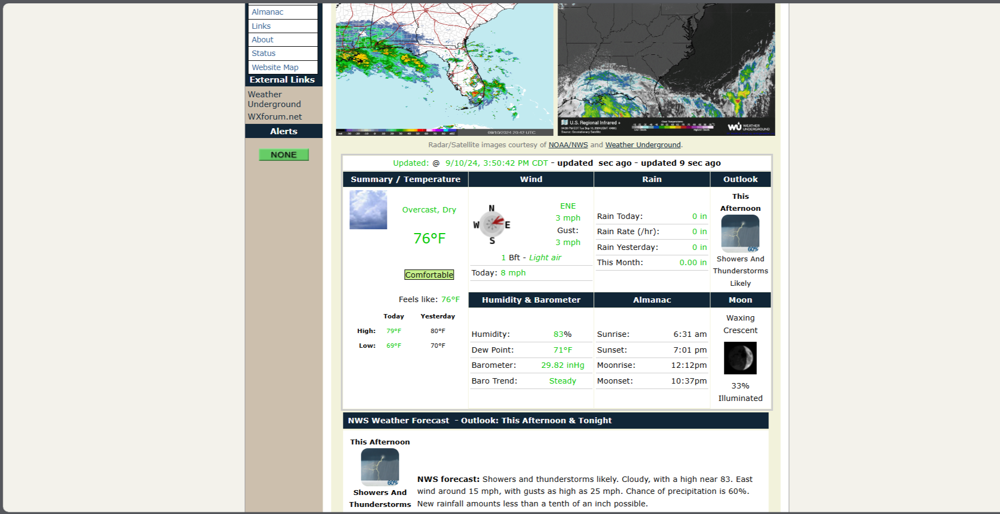

# SaratogaWX-USA-Template
<h2>This Project is under development.</h2>
 <h1><b>DISCLAIMER:</b></h1>

 
This Template relies heavily on several API Systems, including Wunderground, NWS, and several more. If one of these API's are down, Wunderground for example: Weather Conditions may be unavaliable.

 <h2>Requirements:</h2>
   
Wunderground Weather Station and <a href="https://www.wunderground.com/member/api-keys">API Key</a>.

   
<a href="https://code.visualstudio.com/">VS Code</a>

   
The Visual Crossing API Key is provided by default.

<h1>Previews</h1>
 
